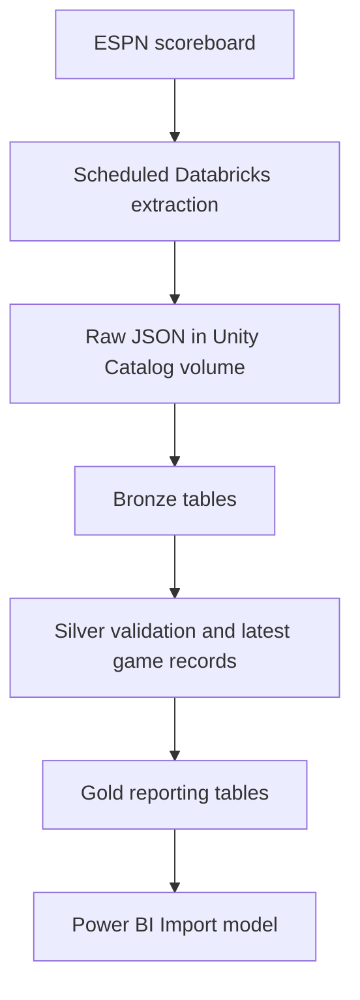

# NFL Data Reliability Platform

An automated data engineering project that ingests NFL scoreboard data from ESPN, preserves raw JSON snapshots, validates game records, and builds reporting tables in Databricks for Power BI.

The scheduled cloud workflow runs extraction and Bronze, Silver, and Gold processing in Databricks. A separate local Python pipeline implements additional reliability features, including change detection, stale-game alerts, structured logging, and audit records.

## Why This Project Exists

A successful HTTP response does not guarantee trustworthy data. Sports feeds can contain incomplete, duplicated, malformed, or stale records. This project explores data quality, replayable processing, orchestration, and operational monitoring using a real NFL feed.

## Current Architecture



The Databricks job runs tasks in order: **Extract → Bronze → Silver → Gold**. Each downstream task depends on its predecessor succeeding. Power BI connects directly to Databricks, removing manual CSV downloads and replacements. Report data updates when the Import model is refreshed; it is not a continuously live connection.

## Current Capabilities

### Scheduled Databricks workflow

- Fetches ESPN scoreboard JSON directly from a Databricks extraction notebook
- Saves timestamped snapshots in a Unity Catalog volume
- Runs extraction and Bronze, Silver, and Gold notebooks as a scheduled job
- Rebuilds Bronze and Silver from the accumulated landing files
- Parses and validates records in Silver, separating valid and invalid data
- Selects the most recent snapshot per game rather than retaining duplicate current-game records
- Builds Gold tables for current games, team performance, and team-game results
- Supplies Power BI through a direct Databricks connection in Import mode
- Runs without requiring the local development computer to remain on

### Local Python reliability pipeline

- Extracts scoreboard data with timeouts, retries, and HTTP error handling
- Saves raw JSON for replay and auditing
- Parses nested responses into typed game-level records
- Validates identifiers, teams, scores, game states, and data types
- Quarantines rejected records with reasons
- Writes validated records to Parquet
- Uses SHA-256 fingerprints to classify games as `NEW`, `CHANGED`, or `UNCHANGED`
- Detects potentially stale live games using configurable thresholds
- Creates deterministic reliability-alert identifiers
- Records pipeline status, duration, file locations, and record counts
- Writes structured terminal and file logs
- Supports raw-file upload to Databricks and optional ADLS upload
- Can trigger the existing Databricks job after successful uploads
- Includes unit tests and mocked end-to-end tests

The scheduled extraction notebook currently bypasses the local reliability processing. Change detection, stale detection, and their reporting outputs still need verification or implementation in the Databricks execution path. Local extraction retries do not imply that the scheduled notebook has equivalent retries.

## Technology Stack

| Area | Technology |
|---|---|
| Language | Python 3.12 for local development; Python in Databricks |
| API ingestion | Requests |
| Local transformation | pandas |
| Local analytical files | Apache Parquet / PyArrow |
| Cloud processing and tables | Databricks Free Edition and Delta Lake |
| Scheduled orchestration | Databricks Jobs |
| Active raw landing storage | Unity Catalog volume |
| Additional storage integration | Azure Data Lake Storage Gen2, optional local upload |
| Databricks integration | Databricks SDK and CLI OAuth authentication |
| Reporting | Power BI Desktop, Databricks connection in Import mode |
| Testing | pytest |
| Local configuration | python-dotenv |
| Version control | Git and GitHub |

ADLS integration was implemented separately. The current scheduled workflow lands files directly in the Databricks volume; it does not require an ADLS handoff.

## Repository Organization

The local project includes `src/pipeline.py`, `src/config.py`, `src/validation.py`, unit and end-to-end tests, `.env.example`, and `requirements.txt`.

Generated local outputs are excluded from Git:

| Directory | Contents |
|---|---|
| `data/raw/` | Raw JSON snapshots |
| `data/processed/` | Validated Parquet records |
| `data/quarantine/` | Rejected records and reasons |
| `data/alerts/` | Reliability alerts |
| `data/audit/` | Pipeline audit records |
| `data/state/` | Previous game state |
| `logs/` | Operational logs |

The scheduled notebooks and job are configured in the Databricks workspace. Exporting and versioning those workspace assets in this repository remains a documentation and reproducibility task.

## Local Setup

### 1. Clone and create an environment

```powershell
git clone <repository-url>
cd nfl-data-reliability
py -3.12 -m venv .venv
.\.venv\Scripts\Activate.ps1
```

### 2. Install dependencies and configure

```powershell
python -m pip install -r requirements.txt
Copy-Item .env.example .env
```

Review configuration and execution settings before running. The local pipeline can upload files and trigger a real Databricks job; it is not necessarily a local-only command.

### 3. Authenticate for local Databricks operations

Install the Databricks CLI, then authorize the profile used by the project:

```powershell
databricks auth login --host "https://YOUR-WORKSPACE-HOST" --profile nfl-project
```

Use the workspace base URL without notebook paths, query strings, or `/oidc`. Configure the intended volume path and job ID in the project. Do not commit credentials or authentication profiles.

### 4. Run the local pipeline

```powershell
python -m src.pipeline
```

Check the configured season and requested weeks before execution. For backfill, request the missing historical weeks. Routine updates do not require re-fetching every prior week.

### 5. Run tests

```powershell
python -m pytest -v
```

Tests should use controlled API responses and replace external uploads with mocks. The end-to-end test uses a temporary data directory, mocks Databricks upload, and disables ADLS upload.

## Scheduled Cloud Execution

1. Maintain the extraction, Bronze, Silver, and Gold notebooks in Databricks.
2. Save extraction output into the volume landing folder consumed by Bronze.
3. Configure one job with sequential task dependencies.
4. Run the complete job manually and verify historical games remain in Gold.
5. Enable a scheduled trigger and keep maximum concurrent runs at one for the full-load workflow.
6. Inspect job results and refresh Power BI to retrieve updated Gold data.

The extractor uses ESPN's default scoreboard response and reads its season and week metadata. This avoids a permanently hardcoded week, but does not guarantee historical completeness. Historical backfill remains a separate operation.

## Data Layers and Reload Behavior

| Layer | Purpose |
|---|---|
| Landing JSON | Retains historical raw source snapshots |
| Bronze | Loads source snapshots for downstream processing |
| Silver | Parses, validates, separates invalid records, and selects latest game records |
| Gold | Provides reporting tables and performance metrics |
| Local operational outputs | Stores local audit records, state, alerts, and logs |

Current processing uses full loads over accumulated JSON files rather than incremental ingestion. Latest-record selection must be scoped to each `game_id` and ordered by retrieval timestamp. Selecting only the newest file or week would discard historical games.

Keep older valid snapshots for replay. Deleting a record only from Gold, Silver, or Bronze is temporary when an upstream full load can recreate it. To exclude unwanted test snapshots, remove them from landing or apply an explicit exclusion rule before rebuilding downstream tables.

## Reliability and Testing

Local validation covers missing identifiers or nested structures, invalid season/week types, identical teams, invalid or negative scores, and unexpected game states. Local stale detection separately evaluates unchanged live games against a configured threshold.

Unit tests cover validation, hashing, state classification, stale detection, and alert creation. The mocked end-to-end test verifies raw, processed, state, and audit outputs in an isolated temporary directory without real uploads.

Cloud verification includes task completion, landing-file creation, retention of historical weeks, and agreement between Gold and Power BI. Duplicate-safe reruns and invalid-record handling should also be demonstrated explicitly. Local tests alone do not establish correctness of the scheduled notebooks.

## Remaining Work

- Add retry handling to scheduled extraction and configure job failure notifications
- Verify or implement change detection and stale-game alerts in Databricks
- Publish freshness, rejection, completeness, and latency metrics to reporting tables
- Demonstrate duplicate-safe reruns and quarantine behavior with controlled data
- Automate Power BI Import refresh where the deployment and licensing support it
- Export notebooks and job configuration into version control
- Document schemas, backfill, recovery, and reproducible setup
- Add CI checks for tests and code quality

Possible later extensions include incremental loading, play-by-play sequence checks, and cross-provider score/status comparisons.

## Project Status

The scheduled Databricks ingestion and Bronze/Silver/Gold workflow is working, and Power BI reads directly from Databricks. The local Python reliability foundation is also implemented. Remaining work focuses on verifying reliability features in the scheduled path, operational monitoring, refresh automation, and reproducibility.

The current deployment is scheduled batch processing, not continuous real-time monitoring. Its freshness depends on the job schedule and Power BI refresh. Databricks Free Edition compute quotas also constrain execution frequency.

## Data Source Note

This project uses a publicly accessible ESPN JSON endpoint for educational and portfolio purposes. It is not represented as an officially supported public ESPN API and may change without notice. That instability is treated as a realistic reliability-engineering constraint.
